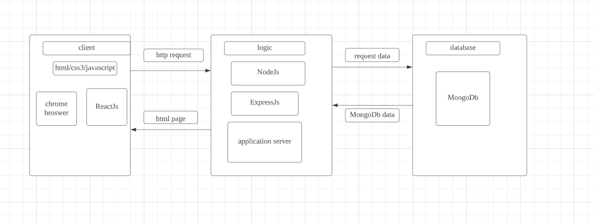
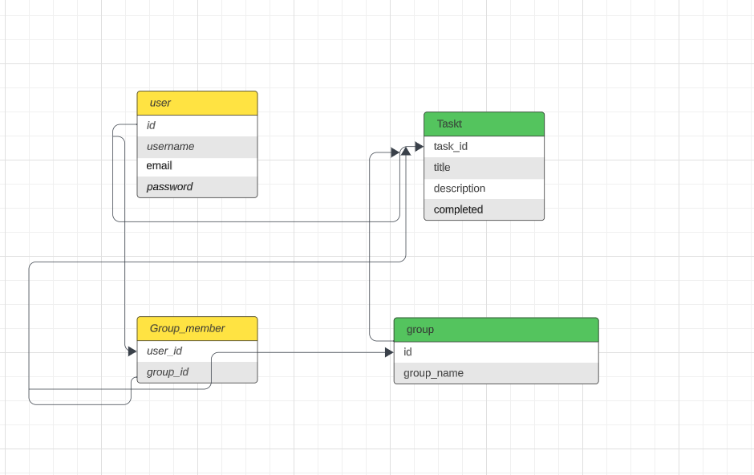
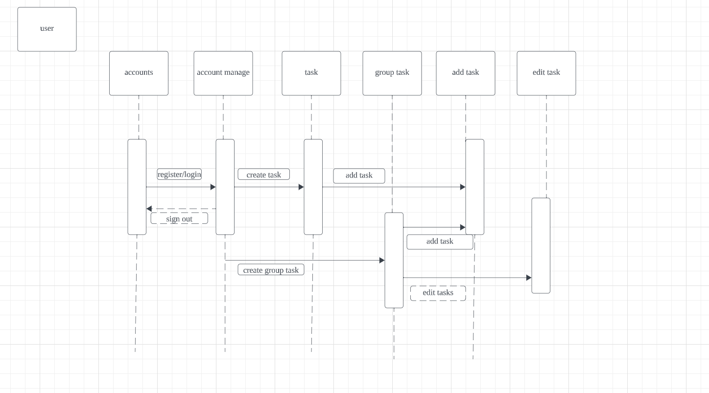

basic mern stack structure

Our diagram is simple. We have the usual User_DB with the typical properties. They can optionally be a group member, but not required for our app. GroupMember_DB is its own schema and connects User_DB to Group_DB. Group_DB only has an id and name. Its purpose is to just associate people together. Last is the Task_DB. This will hold 4 properties: associated_id, title, description, and completed. The associated_id is a foreign key that associated with either a group or an individual, which is why theres two DB connected to it. The rest are there to hold relavent information.

flow chart start with login/sign up interaction, then task create/task group create, then edit task, and lastly sign out
