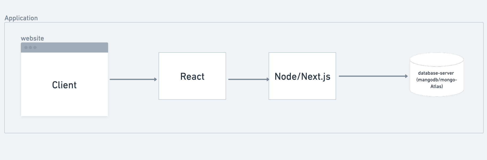
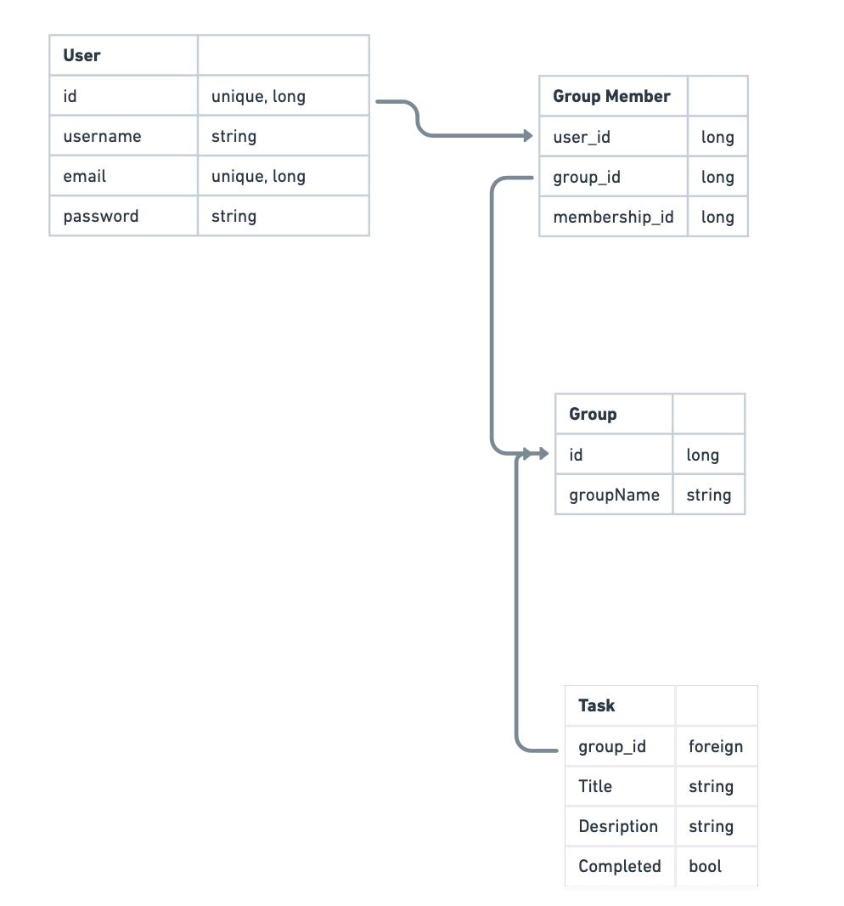
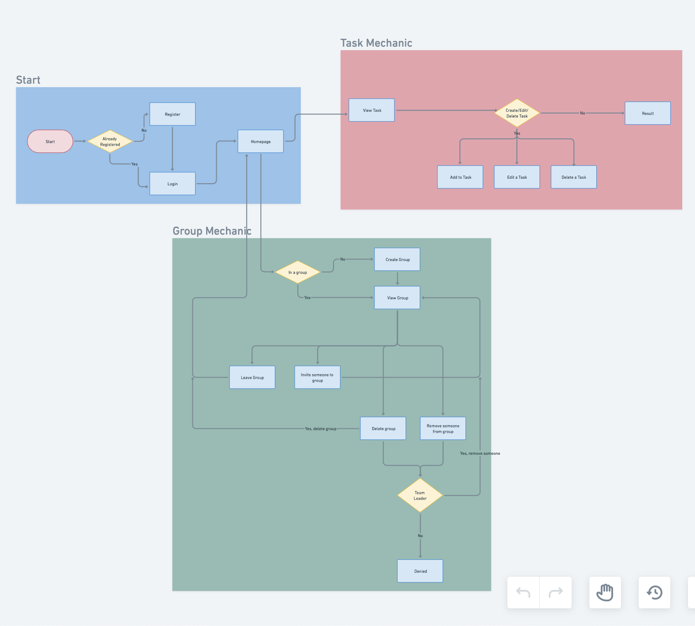

Still learning MERN. As far as I can tell, the client can be controlled/interactived with React. We use Node/Next.js to communicate between the frontend and the database. And we use Mongodb to store our information. Currrently, I also plan on using mongo Atlas to store my data. 

Our diagram is simple. We have the usual User_DB with the typical properties. They can optionally be a group member, but not required for our app. GroupMember_DB is its own schema and connects User_DB to Group_DB. Group_DB only has an id and name. Its purpose is to just associate people together. Last is the Task_DB. This will hold 4 properties: associated_id, title, description, and completed. The associated_id is a foreign key that associated with either a group or an individual, which is why theres two DB connected to it. The rest are there to hold relavent information.

The flowchart has three major components: the initial start, the group mechanics, and the task. The startwill be just a login/register interaction. This leads to the two other components. The Gourp Mechanics is the ability to create a group and perform CRUD with it. Users can create a group, add people to group, leave a group, remove someone from a group, or delete the group. Similarly, for the Task users/groups should be able to create, edit, or deleted a task. 
