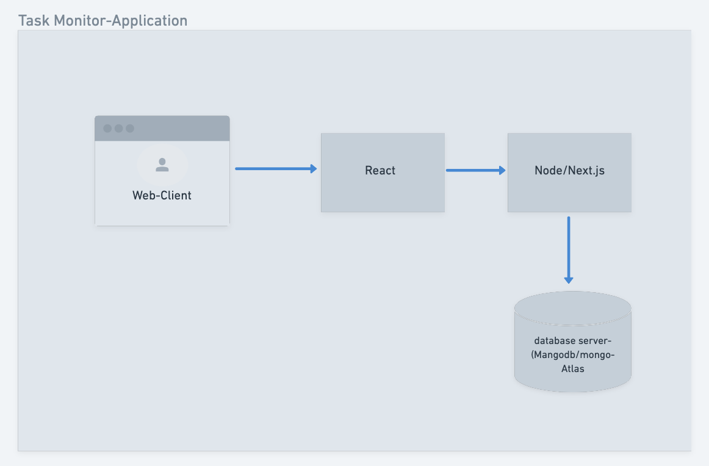
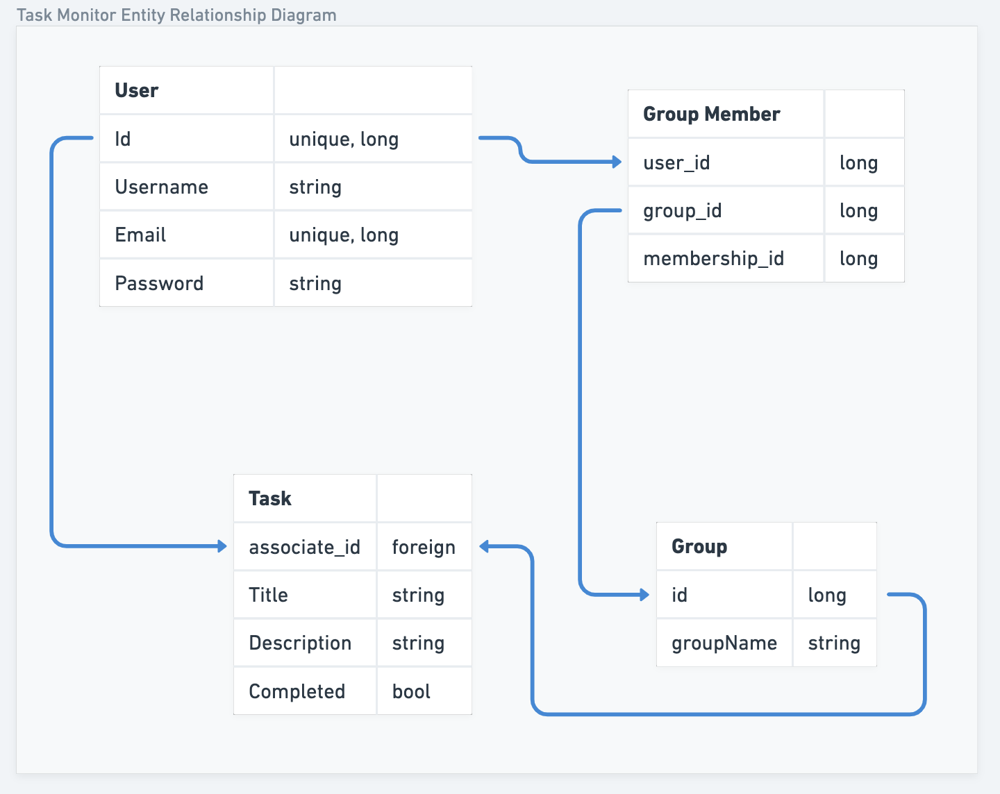
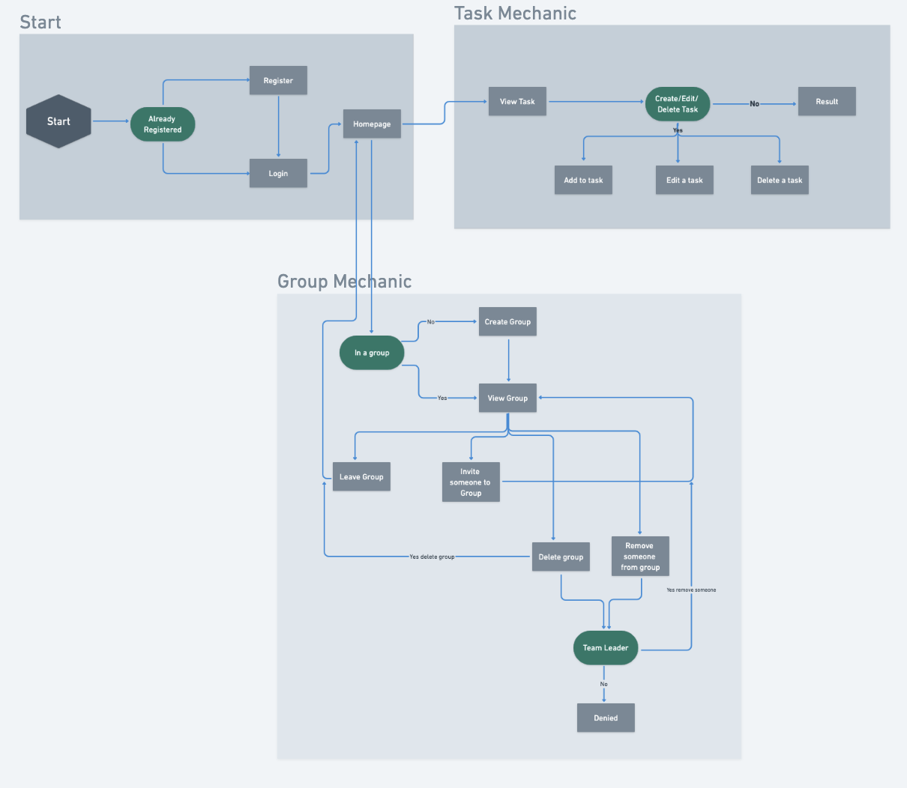

### Task Monitor Architecture

The user interface is made interactive using React for a smooth and engaging experience. We connect the front end to the database with Node.js and Next.js, ensuring efficient data communication. All the information is stored in MongoDB. Might use MongoDB Atlas to securely store and manage our data.

Our setup is pretty straightforward. First, we have the User database (User_DB) with the usual info. Users can choose to be part of a group, but it's not mandatory. Then, there's the GroupMember database (GroupMember_DB), which links users from User_DB to the Group database (Group_DB). The Group_DB only keeps an ID and a name to connect people. Lastly, there's the Task database (Task_DB) with properties like associated_id, title, description, and completed. The associated_id connects to either a group or an individual, which is why it's linked to both databases. The other properties just store relevant details.

The flowchart breaks down into three main parts: the beginning, group functions, and tasks. Starting with a simple login or registration interaction, users move on to the Group Mechanics and Task sections. In Group Mechanics, users have the power to create a group and manage it using CRUD operations. This involves creating a group, adding or removing people, leaving a group, or deleting it. Likewise, for Tasks, users and groups can create, edit, or delete tasks as needed.

