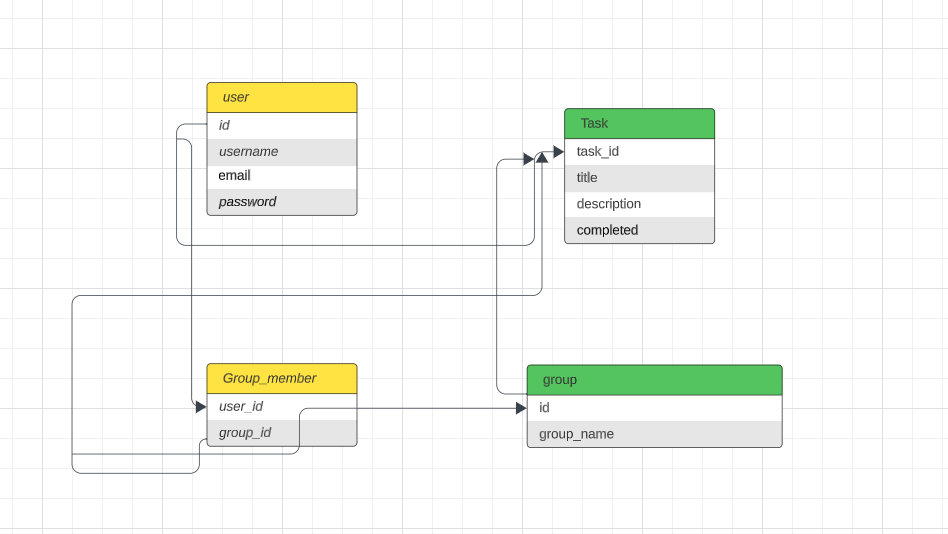

basic mern stack structure

user db has 4 typical properties, user id connect to Group_member db and task db and group db; group_id in Group_member db connec to group db and task_id in task db.

flow chart start with login/sign up interaction, then task create/task group create, then edit task, and lastly sign out
