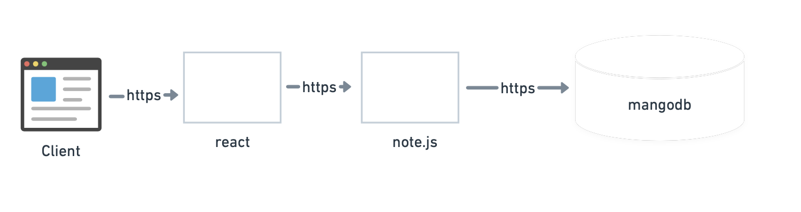

The user client is the frontend of the application. It will use react and node to sent request and get response. finally, we use mongodb to save our data and manage our data.

First, a User_DB is shown, which can choose to be a group member or a single task. GroupMember_DB connects User_DB to Group_DB. Task_DB is the main database which contains associated ID, title, description and completed. Group_DB is used to connect different personal IDs and then connect to a group.

