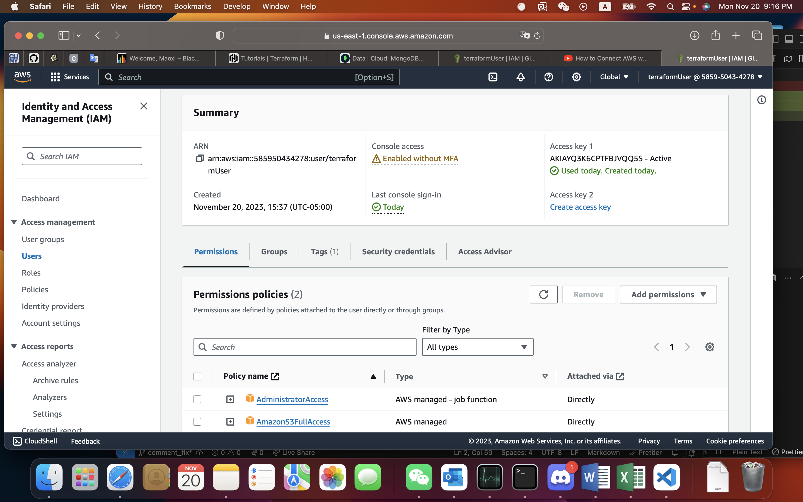
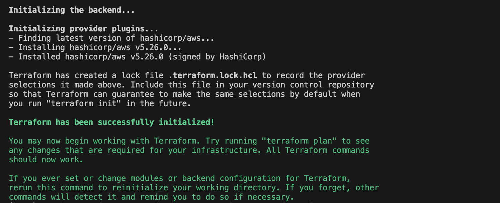
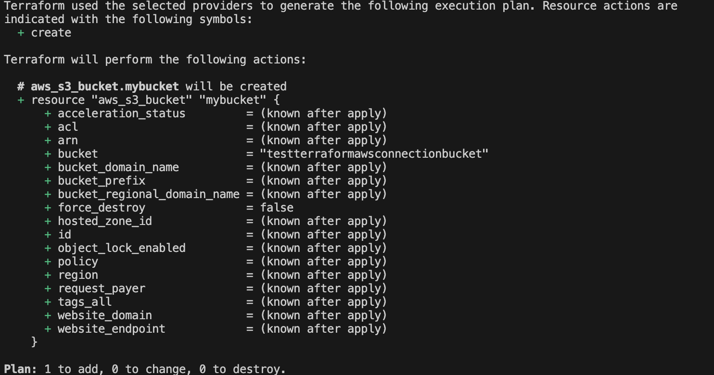
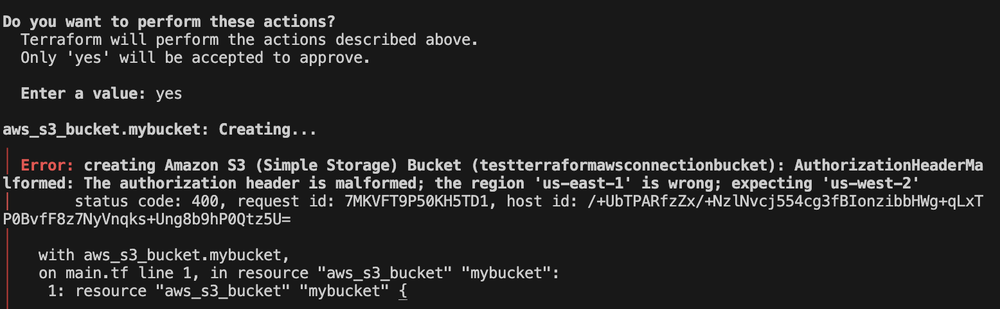

## connent aws

finish the aws set up but can't connet our project, try to look some tutorial but can't solve that. there are some scrrenshoot for using terraform

there is some error for this part and try to solve it but did't work.

# to deploy our software

## Get React

https://create-react-app.dev/docs/getting-started/

### Open backend

To get started, pull the repository. Open terminals and one shoud cd to backend. run:
'''
python manage.py runserver
'''
This will link you to a localhost:8000. It will get a dead link, just add '/api/' at the end of the link.

### Open frontend

The other should cd to frontend and run
'''
npm start
'''
then it will open up the link in your default browser. Now you can run our project.
